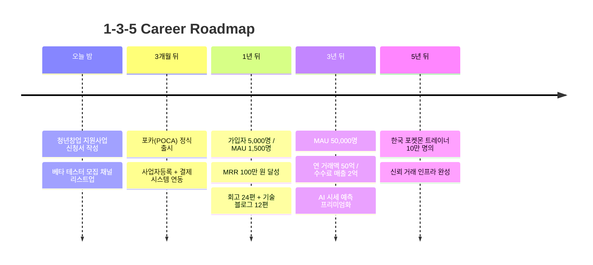

# 👋 안녕하세요, 오우진입니다

> **한국 포켓몬 TCG 거래 플랫폼 [포카(POCA)](#-current-project--포카poca) 창업자 / 1인 풀스택 개발자**  
> 명지전문대 AI게임소프트웨어학과 재학 중 · 파주 거주

---

## 🧭 Career Roadmap

> "어디로 갈지 모른다면, 아무 길이나 가도 돼." — 체셔 고양이  
> 그래서 **속도(Speed)보다 방향(Direction)** 을 먼저 세웠습니다.

---

### 🌟 5년 후 — Vision (장기 비전)

> **"포켓몬 카드를 사랑하는 한국 트레이너 10만 명이,  
> 가품 걱정 없이 거래하고 컬렉션을 자랑하는  
> 신뢰 인프라를 만든다."**

내가 사랑하는 영역(TCG)에서, 한국 시장에 100% 특화된 신뢰 인프라를 만드는 것 — 이것이 **흔들리지 않는 나의 북극성**입니다.

---

### 🗺️ 3년 후 — Objective & Key Results (중기 목표)

**Objective**  
> 한국 TCG 거래 플랫폼 시장에서 **카테고리 1등** 자리에 오른다.

**Key Results**

| # | 지표 | 목표 |
|---|------|------|
| KR1 | MAU | **50,000명** (한국 트레이너 추정 모집단의 5%) |
| KR2 | 연 거래액 / 수수료 매출 | **50억 / 2억 원** (수수료 4% 기준) |
| KR3 | 프리미엄 전환율 / 제휴사 | **8%** + 카드샵 제휴 **20개사** |

---

### 🎯 1년 후 — SMART Goals (단기 목표)

수치로 측정 가능하고 마감일이 명확한 목표만 적었습니다.

#### ① 출시 & 트랙션
> **2027년 5월 8일까지**, 포카(POCA)를 정식 출시하고  
> **누적 가입자 5,000명 / MAU 1,500명 / 누적 거래 500건** 달성

#### ② 매출 & 사업 안정성
> **2027년 5월 8일까지**, **월 수수료 매출(MRR) 100만 원** 안정화  
> 사업자등록 + 토스페이먼츠 연동 완료로 합법적 정산 구조 확립

#### ③ 기술 자산화
> **2027년 5월 8일까지**, **개발 회고 24편 + 기술 블로그 12편** 발행  
> AI 시세 예측 모델 v1을 학과 졸업 작품과 연계해 출시

---

## 🚀 Current Project — 포카(POCA)

> 한국 포켓몬 트레이너를 위한 **실물 카드 도감 + P2P 거래 + 커뮤니티** 플랫폼

**핵심 차별점**
- 🇰🇷 한국 시장 100% 특화 (986종 한↔영↔일 매핑, 106개 세트 한판 정식명)
- 📸 사용자 직접 촬영 + 운영자 검증 진품 인증
- 🚫 디지털 카드(Pokémon TCG Pocket) 자동 차단
- 🤖 AI 페어 프로그래밍(Claude Code) — 1주일에 24+ 마일스톤, 14개 DB 마이그레이션

**Tech Stack**  
`React 18` · `TypeScript` · `Vite` · `Supabase (PostgreSQL / Auth / Realtime / Storage)` · `TCGdex API`

---

## 🛠️ 이전 경험

- **테니스장 회원관리 웹** — 풀스택 개발 경험

---

## 📫 Contact

- ✉️ vvww0905@gmail.com

---

이 로드맵은 분기마다 업데이트됩니다. · Last updated: 2026.05.08
